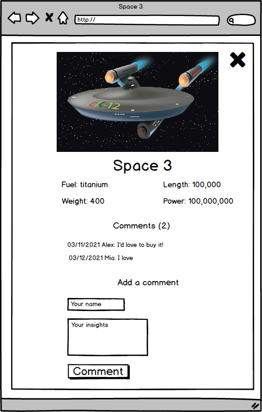
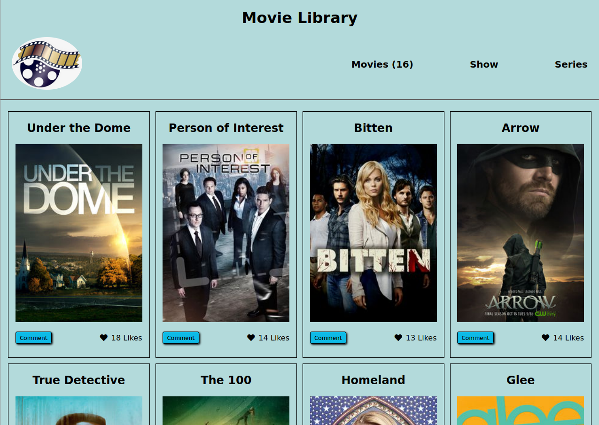

# Yuriy Chamkoriyski & Bonke Gcobo Javascript capstone project

> API-based webapp from Module 2 at Microverse

## Wireframe requirements

### The Home Page low fidelity

### The low fidelity for comment pop up page

## Actual screenshot

## Video presentation
[Video link](https://youtu.be/QOhLsW7cuFU)

## Description
The JavaScript capstone project  is about building your own web application based on an external API. You will select an API that provides data about a topic that you like and then build the webapp around it.

## Requirements

### APIs
- First, you need to find an API so you can base the development of the webapp around it. The API should allow you to:
  - Get a list of items with a unique item id (or generate the unique id).
  - For a given item, get detailed information about it.
- You will use our [Involvement API](https://www.notion.so/Involvement-API-869e60b5ad104603aa6db59e08150270) to record the different user interactions (likes, comments and reservations).

### Interfaces
- You should build these interfaces:
  - The home page.
  - The comments popup.
- You should follow the layout of the wireframes provided. You should personalize the rest of the design including colors, typographies, spacings, etc.
- Home page
  - When the page loads, the webapp retrieves data from:
    - The selected API and shows the list of items on screen.
    - The Involvement API to show the item likes.
  - Remember that your page should make only 2 requests:
    - One to the base API.
    - And one to the Involvement API.
  - When the user clicks on the Like button of an item, the interaction is recorded in the Involvement API and the screen is updated.
  - When the user clicks on the "Comments" button, the Comments popup appears.
  - Home page header and navigation similar to the given mockup.
  - Home page footer similar to the given mockup.
- Comments popup
  - When the popup loads, the webapp retrieves data from:
    - The selected API and shows details about the selected item.
    - The Involvement API to show the item comments.
  - When the user clicks on the "Comment" button, the data is recorded in the Involvement API and the screen is updated.

### Counters
Counters We have counters in all the interfaces that show:
- The number of items (home).
- The number of comments (comments popup).

### Technical set up
- Set up the repository on GitHub and use Gitflow.
- Set up webpack.
- Set up a JavaScript testing library (Jest).

## Instructions:

 ### Cloning the repo to your local system (if you already have git, installed in your system)

 1) Copy this Link `https://github.com/Hombre2014/JS_Capstone_project.git`
 2) Open your terminal or command line
 3) Run the command: `git clone https://github.com/Hombre2014/JS_Capstone_project.git`
 4) Open the folder with your code editor: `cd JS_Capstone_project`
 5) Now You can edit the code and check the changes in the browser using Live Server

## Built With

- Major languages: HTML, CSS, JS
- Frameworks: none
- Technologies used: Git, webpack, Jest

## Live Demo

- [Live demo link](https://chamkoriyski.me/JS_Capstone_project/dist)

## Getting Started

To get a local copy up and running follow these simple example steps.

### Prerequisites

- Internet connection and browser
- A text editor (preferably Visual Studio Code)
- Browser

### Setup

- For detail description of how to get started with webpack, please, look at: [webpack](https://webpack.js.org/guides/getting-started/)

### Install

- [Git](https://git-scm.com/downloads)
- [Node](https://nodejs.org/en/download/)

### Usage

- Clone the repository using `git clone https://github.com/Hombre2014/JS_Capstone_project.git`
- Change directory into the project folder: `cd JS_Capstone_project`
- Run `npm install`
- Run `npm start`
- A new browser will open automatically with application loaded

### Run tests

- Test the number of movies loaded with Jest
- Test the number of comments with Jest

### Deployment

- All the files necessary for deployment are in the /dist folder

## Authors

👤 **Yuriy Chamkoriyski**

- GitHub: [@Hombre2014](https://github.com/Hombre2014)
- Twitter: [@Chamkoriyski](https://twitter.com/Chamkoriyski)
- LinkedIn: [axebit](https://linkedin.com/in/axebit)

👤 **Bonke Gcobo**

- GitHub: [@BonkeGcobo](https://github.com/BonkeGcobo)
- Twitter: [@bonkegcobo](https://twitter.com/bonkegcobo)
- LinkedIn: [Bonke Gcobo](https://www.linkedin.com/in/bonke-gcobo-28a763125/)

## 🤝 Contributing

Contributions, issues, and feature requests are welcome!

Feel free to check the [issues page](https://github.com/Hombre2014/JS_Capstone_project.git/issues).

## Show your support

Give a ⭐️ if you like this project!

## Acknowledgments

## 📝 License

This project is [MIT](./license.md) licensed.